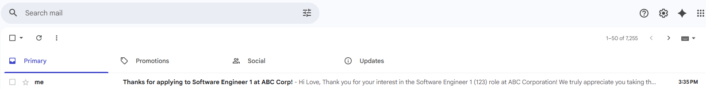
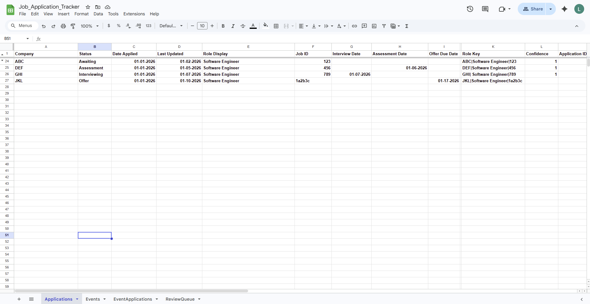
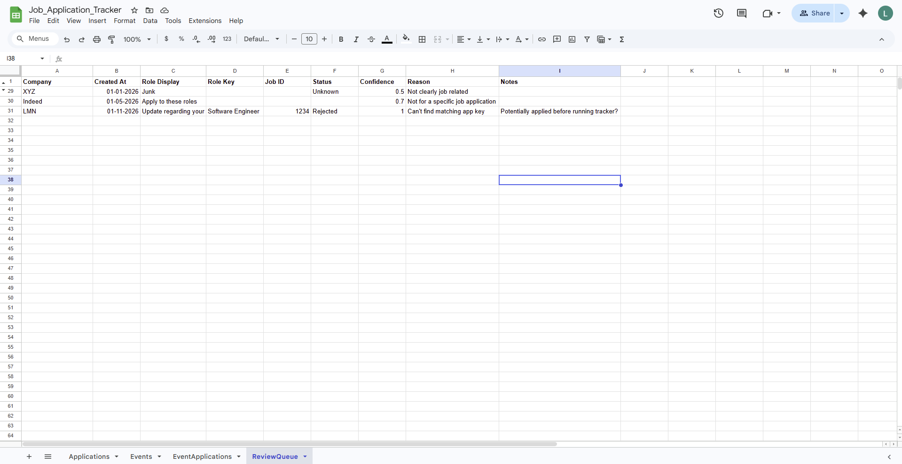
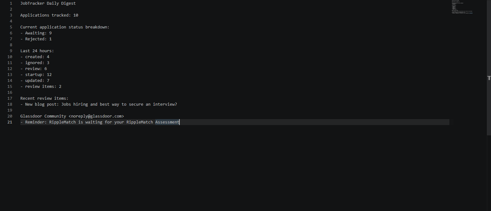

# Demo

## Standard Workflow Example

1. A job-related email arrives in Gmail 

2. The poller fetches candidate messages

3. Obvious junk is filtered locally, preventing an unnecesary API request.

4. Remaining candidates are sent to the extractor 

5. The reconciler:
- Creates an application if doesn't exist or updates exisiting app

- Creates an event if needed
- Links events to applications
- Sends ambiguous emails to the review queue

6. Gmail labels are applied:
- JobTracker/Processed
- JobTracker/Review

7. Daily and weekly digests summarize recent activity
